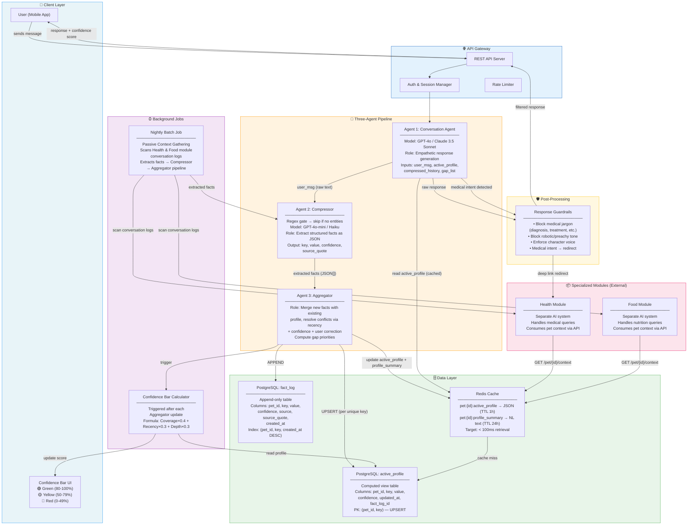
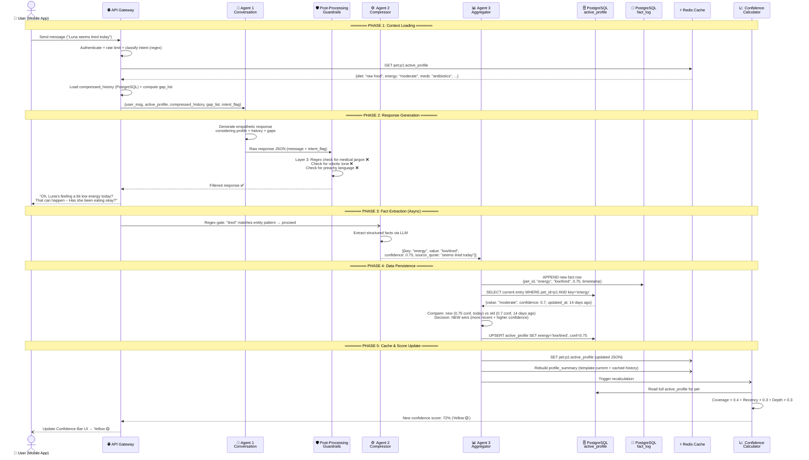
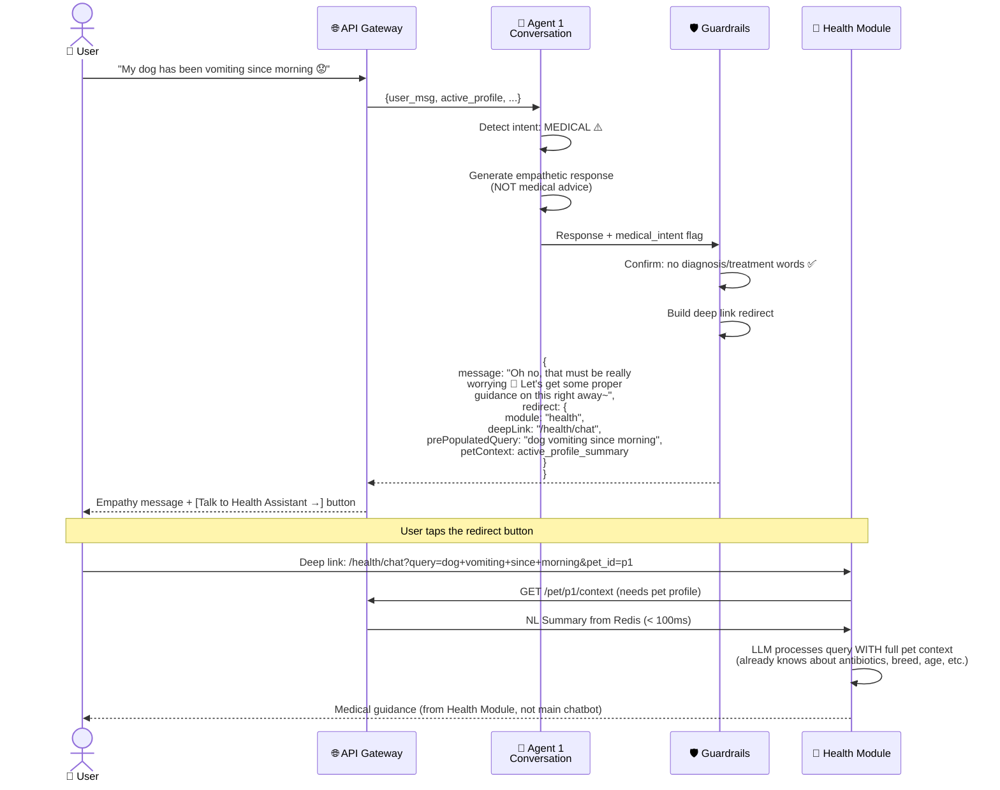
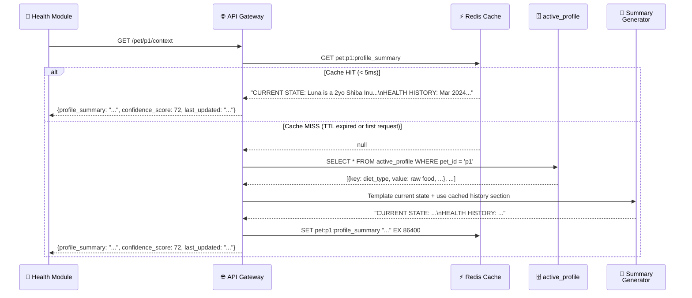
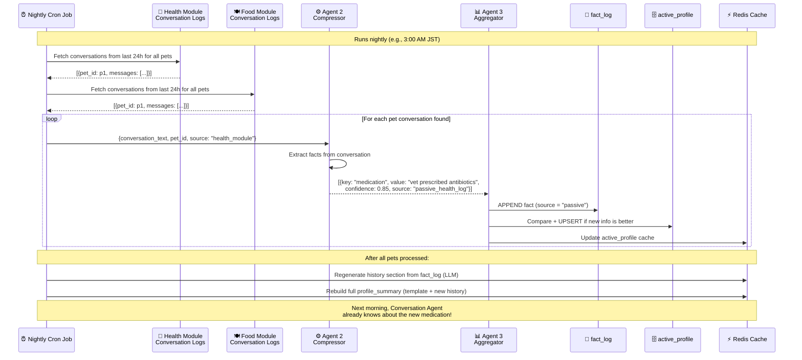

## 3. System Architecture Diagram



---

## 4. Data Flow Diagram (Sequence)

### 4.1 Primary Conversation Flow

This sequence diagram shows the complete data flow when a user sends a message and receives a response.



### 4.2 Medical Query — Redirection Flow

This diagram shows what happens when the user asks a medical question that triggers the guardrail redirect.



### 4.3 External Module — Context Retrieval Flow

Shows how Health/Food modules fetch pet context, including the Redis cache-miss fallback.



### 4.4 Nightly Batch — Passive Context Gathering

Shows how the system learns from other modules' conversations without the user explicitly telling it.



---

## 5. Core Agents — The Three-Agent Pipeline

### 5.1 Agent 1: Conversation Agent

| Property           | Detail                                                                                                                                                       |
| ------------------ | ------------------------------------------------------------------------------------------------------------------------------------------------------------ |
| **Responsibility** | Generate empathetic, on-brand responses. This is the ONLY agent the user directly interacts with.                                                            |
| **Model**          | GPT-4o or Claude Sonnet (high emotional intelligence, nuance in Japanese — see language note above)                                                          |
| **Inputs**         | `pet` (name, species, breed, life_stage), `active_profile_rows`, `compressed_history`, `relationship_context`, `current_session`, `gap_list`, `user_message` |
| **Output**         | JSON with: `message` (str), `intent_flag`, `questions_asked_count`, `entity_detected` (bool) — passed through guardrail filter before reaching user          |
| **Key Constraint** | Ask only 1–3 questions per session. Never force consecutive questions.                                                                                       |

> **Input definitions:**
>
> - `pet` — basic identity: name, species, breed, life_stage (computed from DOB). Structured object, not free text.
> - `active_profile_rows` — current known facts about the pet (structured key-value rows from Redis/active_profile table)
> - `compressed_history` — NL summary of what the pet has done/experienced in past sessions (pet facts, health history, behavioral patterns)
> - `relationship_context` — NL summary about the **user** (emotional patterns, interaction style, tone preferences, session count) — equivalent to "user profile summary" in the PRD. See Section 6.4 for storage.
> - `current_session` — messages exchanged so far in THIS session only (= "current message history" in PRD)
> - `gap_list` — missing or stale profile fields ordered by priority rank. Agent 1 is the only agent that talks to the user, so gap awareness must live here — Agent 1 picks 1-2 gaps to ask about naturally. The gap list is computed by the context builder (Section 5.4) and injected into Agent 1's input.
> - `user_message` — the current user message being processed
>
> **`message_reading_key` — removed from inputs.** This flag was redundant with `intent_flag` from the Layer 1 classifier (Section 13.1). Agent 1 already adjusts tone based on `intent_flag`. Removing it simplifies the interface. See Section 16.4 for the decision record.

**Prompt Template:**

```
SYSTEM:
You are a warm, friendly pet companion for {{pet_name}}, a {{age}} {{breed}} {{species}}.
You are NOT a vet. You NEVER diagnose, prescribe, or give medical/nutritional advice.
Primary language: Japanese. Secondary: English. Always respond in the user's language.

## Character Rules
- Use gentle sentence endings like "~maybe!" and "~" (e.g., 「元気そうですね～！」)
- Never be preachy, robotic, or judgmental
- Ask at most {{max_questions}} questions this session
- If user mentions anything medical/health-related, respond with empathy ONLY
  and set intent_flag to "medical" or "nutritional" in your response JSON

## Pet: {{pet_name}}
Species: {{species}} | Breed: {{breed}} | Life stage: {{life_stage}}

## Pet Profile (current known facts)
{{active_profile_formatted}}

## Information Gaps (pick 1-2 to naturally ask about)
{{gap_list}}

## Pet History (summary of past sessions — what happened with {{pet_name}})
{{compressed_history}}

## User Relationship Context (how this user interacts — their tone, emotional patterns)
{{relationship_context}}

## Current Session
{{current_session_messages}}

Respond ONLY in JSON format:
{
  "message": "your response text",
  "intent_flag": "general" | "medical" | "nutritional",
  "questions_asked_count": number,
  "entity_detected": true | false
}

entity_detected = true if the user's message contains any new or updated factual information
about the pet (diet, health, behavior, weight, medication, etc.) that should be extracted
and stored. Set false for casual messages ("ok", "haha", "thanks") that contain no new facts.
This drives whether Agent 2 (Compressor) is called — false means skip extraction entirely.

USER: {{user_message}}
```

**What goes into the prompt (token budget):**

```
System Prompt:
├── Character guidelines (~150 tokens, static)
├── Active Profile (~200-500 tokens, from Redis)
│   ├── Pet: Luna, Shiba Inu, 2 years
│   ├── Diet: raw food (conf: 0.95)
│   ├── Energy: low/tired (conf: 0.75, today)
│   └── Medication: antibiotics (conf: 0.85)
├── Gap List (~50-100 tokens, computed)
│   ├── Feeding frequency (Rank A, never asked)
│   └── Exercise level (Rank B, 45 days stale)
├── Pet History / Compressed History (~200-400 tokens, from PostgreSQL)
│   └── "Last session: user was worried about Luna's appetite. Vet visit for ear infection."
├── User Relationship Context (~100-200 tokens, from user_relationship_context table)
│   └── "Owner tends to be anxious. Prefers short replies. 7 sessions total. Usually chats in evenings."
└── Current session messages (~200-500 tokens, last N turns)

Total context: ~900-1700 tokens — well within limits
```

### 5.2 Agent 2: Compressor

| Property           | Detail                                                                                                                                                                                                                                                                                                                                                                                                                                |
| ------------------ | ------------------------------------------------------------------------------------------------------------------------------------------------------------------------------------------------------------------------------------------------------------------------------------------------------------------------------------------------------------------------------------------------------------------------------------- |
| **Responsibility** | Convert natural language into structured JSON facts (pet facts only — user behavioral signals are handled separately during compaction, see Section 12.6)                                                                                                                                                                                                                                                                             |
| **Model**          | GPT-4o-mini or Claude Haiku for prototype. **Note:** The PRD recommends a full model (GPT-4o / Claude Sonnet) for Agent 2, arguing that structured extraction errors compound downstream. Since the two-gate filter (regex + Agent 1 entity_detected) already skips ~50-60% of messages before this agent runs, a full model is more affordable than it appears. Revisit this decision after evaluating prototype extraction quality. |
| **When called**    | Only if BOTH gates pass: (1) regex pre-filter detects entity patterns AND (2) Agent 1 outputs `entity_detected: true`. If Agent 1 says `entity_detected: false`, skip even if regex passed — Agent 1 has full context and is a smarter filter.                                                                                                                                                                                        |
| **Input (API)**    | `Compressor.run(message: str, pet_id: str)` — `pet_id` is a routing parameter for the Aggregator. It is **never passed to the LLM**.                                                                                                                                                                                                                                                                                                  |
| **Input (LLM)**    | User message text + output schema (field names + descriptions). **No pet context. No gap_list. No history.** The LLM extracts only what is explicitly in the current message.                                                                                                                                                                                                                                                         |
| **Output**         | Array of `{key, value, confidence, time_scope, uncertainty, source_quote, timestamp}`                                                                                                                                                                                                                                                                                                                                                 |

> **Q: Why doesn't the Compressor receive the gap_list or pet profile?**
>
> **A: Because it's not the Compressor's job.** The Compressor has one job: read a message, extract structured facts from it. That's it.
>
> - The **gap_list** belongs to Agent 1 — Agent 1 is the one talking to the user and deciding what to ask next. Agent 1 needs to know what's missing so it can ask smart follow-up questions.
> - The **pet profile** belongs to Agent 1 — it needs profile context to respond naturally. The Compressor doesn't respond to anyone; it just extracts.
> - Giving the Compressor the pet profile or gap_list would: (a) inflate its context window cost on every call, (b) risk the LLM "filling in" facts from context rather than extracting what the user actually said — a hallucination risk.
>
> Keep Compressor stateless and message-scoped. Agent 1 handles awareness. Agent 3 handles storage decisions.

#### Regex Pre-filter (Skip unnecessary LLM calls)

Before calling the Compressor LLM, a simple regex check determines if the message contains any extractable entities. Messages like "ok", "thanks", "haha" are skipped entirely — no LLM cost.

```python
ENTITY_PATTERNS = [
    r"\b(eat|ate|food|kibble|raw|diet|feed|meal|treat)\b",
    r"\b(tired|energy|sleep|active|lazy|playful|lethargic)\b",
    r"\b(vet|medicine|pill|medication|antibiotics|vaccine)\b",
    r"\b(walk|exercise|run|play|park)\b",
    r"\b(weight|gained|lost|kg|pounds|fat|thin)\b",
    r"\b(poop|pee|toilet|bathroom|diarrhea|constipat)\b",
    r"\b(groom|bath|brush|fur|coat|shed)\b",
    r"\b(scared|anxious|aggressive|shy|friendly|bark)\b",
    r"\b(vomit|bleed|lump|limp|swollen|cough|sneez)\b",
    r"\b(allerg|itch|scratch|rash|skin)\b",
]

def has_extractable_entities(message: str) -> bool:
    return any(re.search(p, message, re.IGNORECASE) for p in ENTITY_PATTERNS)

# Usage:
# "Luna seems tired today" → True (matches "tired") → proceed to Agent 1 check
# "haha okay thanks!"      → False                  → skip Compressor entirely
```

**Two-gate filter — how the gates combine:**

```
User message
    │
    ▼
[Gate 1] Regex pre-filter (~1ms, free)
    │ False → skip Agent 2 entirely
    │ True ↓
    ▼
Agent 1 runs → produces response + entity_detected
    │
    ├── entity_detected = false → skip Agent 2
    │   (Agent 1 has full context; regex matched a keyword but nothing new was stated)
    │
    └── entity_detected = true → call Agent 2 (Compressor) async
```

Regex catches the obvious skips (pure conversational messages). `entity_detected` from Agent 1 is the smarter second gate — it has full pet profile context and can judge whether the message actually adds something new (e.g., regex matched "kibble" but user said "does she like kibble?" — a question, not a fact statement).

**Why not LLM-only gate:** The regex saves cost on the ~40-60% of messages that are purely conversational. `entity_detected` from Agent 1 handles the remainder without adding a separate LLM call.

#### Compressor Prompt Template

```
SYSTEM:
Extract structured facts about the pet from this message.
No pet context is provided — extract only what is explicitly stated in the message.

For each fact, output:
- key: one of the keys listed below
- value: the extracted information
- confidence: 0.0–1.0 (how certain you are this is what the user meant)
- time_scope: "current" | "historical" | "unknown"
  ("current" = true right now, "historical" = happened in the past, "unknown" = unclear)
- uncertainty: any caveats or ambiguities (empty string if none)
  e.g., "mentioned casually, not a definitive statement", "user may have multiple pets"
- source_quote: exact words from the message that support this fact
- timestamp: null — filled by the API layer

VALID KEYS (with descriptions):
Rank A — Critical:
  chronic_illness        Ongoing diagnosed conditions (diabetes, hip dysplasia, etc.)
  medications            Current medications and reason
  diet_type              Primary food type: raw / kibble / wet / home-cooked / mixed
  feeding_frequency      How many times per day fed
  toilet_timing          Bathroom schedule and frequency
  neutered_spayed        Whether neutered/spayed (yes / no / unknown)
  vaccination_status     Vaccination status (up to date / overdue / unknown)

Rank B — Life context:
  home_alone_frequency   Hours alone per day
  exercise_level         Regular exercise routine
  recent_weight_change   Weight gained or lost recently
  current_weight         Actual current weight (with unit)
  sleep_pattern          Sleep duration and schedule

Rank C — Behavior & personality:
  personality            Overall character (shy, playful, bold, etc.)
  favorite_toys          Specific toys they love
  grooming_frequency     How often groomed
  behavioral_issues      Problem behaviors (scratching, chewing, barking, aggression)
  social_behavior        Behavior with other animals / people
  sleep_location         Where they sleep (bed, crate, floor, etc.)

Rank D — Precision detail:
  diet_brand             Specific food brand
  feeding_notes          Special amounts, positions, instructions
  exercise_type          Walk / swim / fetch / indoor play
  medication_schedule    Dosing schedule and duration
  vet_name               Regular vet's name and clinic
  allergy_trigger        Food or environmental allergies
  training_status        Trained / basic commands / untrained
  health_events          Recent vet visits, acute illness, surgeries

Transient state (current observation — decays quickly):
  energy_level           Current energy (high / moderate / low / tired / lethargic)
  appetite               Current appetite (good / decreased / refusing)

Rules:
- Only extract what is explicitly stated or strongly implied in this message
- Casual mentions → lower confidence (0.5–0.6)
- Definitive statements → higher confidence (0.8–0.95)
- Questions ("does she like kibble?") → do NOT extract as facts (confidence = 0)
- If user says "Actually, X" or "No, it's X" → mark source as "user_correction"
- Return [] if nothing is extractable

USER: {{user_message}}
```

**Extraction categories:**

- **Critical health & diet (Rank A):** chronic_illness, medications, diet_type, feeding_frequency, toilet_timing, neutered_spayed, vaccination_status
- **Life context (Rank B):** home_alone_frequency, exercise_level, recent_weight_change, current_weight, sleep_pattern
- **Behavior & personality (Rank C):** personality, favorite_toys, grooming_frequency, behavioral_issues, social_behavior, sleep_location
- **Precision detail (Rank D):** diet_brand, feeding_notes, exercise_type, medication_schedule, vet_name, allergy_trigger, training_status, health_events
- **Transient state:** energy_level, appetite (current observations — short-lived, decay quickly)

**Example:**

```json
// Input: "Luna seems tired today, she barely touched her kibble this morning"
// Output:
[
  {
    "key": "energy_level",
    "value": "low/tired",
    "confidence": 0.75,
    "time_scope": "current",
    "uncertainty": "casual observation — may not persist",
    "source_quote": "seems tired today",
    "timestamp": null
  },
  {
    "key": "appetite",
    "value": "decreased — barely ate",
    "confidence": 0.8,
    "time_scope": "current",
    "uncertainty": "",
    "source_quote": "barely touched her kibble this morning",
    "timestamp": null
  },
  {
    "key": "diet_type",
    "value": "kibble",
    "confidence": 0.6,
    "time_scope": "current",
    "uncertainty": "not explicitly confirmed as primary diet — may eat other things too",
    "source_quote": "her kibble",
    "timestamp": null
  }
]
```

Note: `diet_type: kibble` has low confidence (0.60) because the user didn't explicitly say "she eats kibble" — she might eat multiple things and kibble was just mentioned. `time_scope` matters for the Aggregator: a `historical` fact (e.g., "Luna had ear infections last year") should update `fact_log` but may not replace a current `active_profile` entry.

### 5.3 Agent 3: Aggregator

| Property           | Detail                                                                         |
| ------------------ | ------------------------------------------------------------------------------ |
| **Responsibility** | Merge new facts with existing profile, resolve conflicts, identify gaps        |
| **Model**          | No LLM needed — this is deterministic logic (code, not AI)                     |
| **Input**          | Extracted facts from Agent 2 + current active_profile rows                     |
| **Output**         | Updated active_profile, updated gap_list, trigger for confidence recalculation |

**Conflict resolution rules (in priority order):**

1. **User explicit correction** always wins (e.g., user says "Actually she eats raw food, not kibble")
2. **Higher confidence + more recent** beats lower confidence + older
3. **Low-confidence new fact cannot beat high-confidence old fact** (new ≥ 0.8× old confidence threshold before it can win)
4. **Same confidence** → more recent wins
5. **Confirmation of existing value** → boost confidence by +0.05 and update timestamp (don't change the value — just mark it as "still true")
6. **True conflicts where both seem equally valid** → store both in `fact_log`, keep existing in `active_profile`, flag for human review (never delete a fact)

**`time_scope` rule:** If Agent 2 tags a fact as `time_scope: "historical"` (e.g., "Luna had ear infections last year"), it is appended to `fact_log` as usual but does NOT overwrite the current `active_profile` entry for that key. It contributes to trend analysis only.

**Aggregator is NOT an LLM call.** It's pure deterministic application logic. The interface is designed so an LLM reasoning model can replace this code later with no changes to the surrounding pipeline:

```
function aggregate(newFact, currentEntry):
    // Always append to fact_log first (append-only, never delete)
    appendToFactLog(newFact)

    // Historical facts don't overwrite current profile
    if newFact.time_scope == "historical":
        return  // stored in log for trend analysis, not current state

    if currentEntry is null:
        // First time we see this key — insert
        insertActiveProfile(newFact)
        return

    if newFact.source == "user_correction":
        // Explicit user correction always wins (Rule 1)
        upsertActiveProfile(newFact)
        return

    if newFact.value == currentEntry.value:
        // Confirmation — same value repeated (Rule 5)
        boostConfidence(currentEntry, delta=0.05)
        updateTimestamp(currentEntry)
        return

    if newFact.confidence < currentEntry.confidence * 0.8:
        // New fact too uncertain to beat existing (Rule 3)
        // Fact is still logged — just doesn't win active_profile
        return

    if newFact.timestamp > currentEntry.timestamp:
        // Newer and sufficiently confident — update (Rules 2 & 4)
        upsertActiveProfile(newFact)
        return

    // True conflict — keep existing, flag for review (Rule 6)
    flagConflictForReview(newFact, currentEntry)
```

#### 5.3.1 What Gets Appended vs What Gets Upserted

This is a common source of confusion. The system has FOUR distinct storage targets with different write patterns:

```
┌─────────────────────────┬────────────────┬──────────────────────────────────────────────┐
│ Storage                 │ Write Pattern  │ What goes here                               │
├─────────────────────────┼────────────────┼──────────────────────────────────────────────┤
│ conversation_log        │ APPEND         │ Every raw message (user + assistant turns)   │
│                         │ (never delete) │ One row per message, forever                 │
├─────────────────────────┼────────────────┼──────────────────────────────────────────────┤
│ fact_log                │ APPEND         │ Every extracted fact from every message       │
│                         │ (never delete) │ One row per extracted fact, forever          │
│                         │                │ Includes historical facts and superseded ones │
├─────────────────────────┼────────────────┼──────────────────────────────────────────────┤
│ active_profile          │ UPSERT         │ Current best-known value per key per pet      │
│                         │ (one row/key)  │ Only ONE row per (pet_id, key) ever           │
│                         │                │ Updated when a better fact arrives            │
├─────────────────────────┼────────────────┼──────────────────────────────────────────────┤
│ compressed_history      │ APPEND         │ Compacted summaries of past sessions          │
│                         │ (new row added │ summary_type = "session_compact" (per N sess) │
│                         │  per compaction│ summary_type = "longitudinal" (weekly/monthly)│
│                         │  run)          │ Old summaries are kept, not replaced          │
└─────────────────────────┴────────────────┴──────────────────────────────────────────────┘
```

**In plain terms:**

- The conversation itself? → raw messages append to `conversation_log`
- Every fact extracted from those messages? → always appended to `fact_log`
- What we currently believe is true about the pet? → UPSERT in `active_profile` (one row per fact type, updated when a better fact comes in)
- The summary of past sessions? → appended to `compressed_history` (new summary per compaction run, old ones kept)

#### 5.3.2 Where Pet Longitudinal Trends Go

**The question:** "Where do we store how Luna was doing last year — trends, patterns, long-term history?"

**The answer — two separate summaries in `compressed_history`, distinguished by `summary_type`:**

| `summary_type`      | What it covers     | How built                      | Rebuilt when             |
| ------------------- | ------------------ | ------------------------------ | ------------------------ |
| `"session_compact"` | Last 5-10 sessions | LLM compacts raw conversation  | After every N sessions   |
| `"longitudinal"`    | Last 3-12 months   | LLM summarizes fact_log trends | Weekly/monthly batch job |

Agent 1 receives **both** types in context — the session compact gives recent relationship context, the longitudinal summary gives long-term health patterns.

```sql
-- Extended compressed_history schema:
ALTER TABLE compressed_history
  ADD COLUMN summary_type VARCHAR(20) NOT NULL DEFAULT 'session_compact';
  -- Values: 'session_compact' | 'longitudinal'

-- Agent 1 receives the latest of each type:
SELECT DISTINCT ON (summary_type) summary, summary_type, created_at
FROM compressed_history
WHERE pet_id = $1
ORDER BY summary_type, created_at DESC;
```

**Why not store the longitudinal summary in `active_profile`?** The `active_profile` is structured key-value facts (current state). Mixing a long LLM-generated narrative into it breaks its structure. The `compressed_history` table is already the right home for NL summaries of past data. The `summary_type` column keeps them cleanly separated.

The same pattern applies to the user: `user_relationship_context` holds user behavioral patterns and is rebuilt during compaction (see Section 12.6).

### 5.4 Context Building Strategy

This is the logic that assembles everything Agent 1 needs before each response. It runs on every user message.

#### Why `pet` and `active_profile_rows` are two separate things — and the typed struct that unifies them

**Q: Can we have one schema for everything? Why does Agent 1 receive `pet` AND `active_profile_rows` as two separate inputs?**

They are stored in two tables for good reasons, but merged into one typed struct before reaching Agent 1:

|                   | `pet` table                                                                         | `active_profile` table                                                           |
| ----------------- | ----------------------------------------------------------------------------------- | -------------------------------------------------------------------------------- |
| **What it holds** | Identity — who this pet is                                                          | Knowledge — what we've learned about this pet                                    |
| **Set by**        | User at signup (form)                                                               | Agent 2 + Agent 3 pipeline (extracted from conversation)                         |
| **Changes?**      | Almost never (`name`, `species`, `breed` permanent; `life_stage` computed from DOB) | Constantly — new facts arrive every session                                      |
| **Schema type**   | Fixed typed columns                                                                 | Flexible key-value rows — new fields added without DB migration                  |
| **Examples**      | `name: "Luna"`, `species: "dog"`, `life_stage: "adult"`                             | `diet_type: "raw food"`, `chronic_illness: "none"`, `medications: "antibiotics"` |

**At the code layer:** `build_agent_context()` merges both into one typed `AgentContext` struct — Agent 1 always receives a single clean object, not two separate dicts:

```python
from dataclasses import dataclass, field
from datetime import datetime

@dataclass
class PetIdentity:
    """Immutable fields from the `pet` table. Set at signup. NEVER extracted by Agent 2."""
    id: str
    name: str
    species: str        # "dog", "cat"
    breed: str
    life_stage: str     # "puppy", "junior", "adult", "senior" — computed from date_of_birth

@dataclass
class ProfileFact:
    """One extracted fact from `active_profile`. One row per (pet_id, key)."""
    key: str            # "diet_type", "chronic_illness", "medications", etc.
    value: str
    confidence: float
    updated_at: datetime

@dataclass
class AgentContext:
    """
    Complete context passed to Agent 1. Merges identity (pet table) + learned knowledge
    (active_profile) into one typed structure.

    pet     ← FROM pet table       — who the pet IS (permanent identity)
    profile ← FROM active_profile  — what we KNOW about the pet (learned from conversation)
    These are different concepts. They stay as two DB tables. They merge into one struct here.
    """
    pet: PetIdentity
    profile: list[ProfileFact]       # Rank A–E + Transient facts from active_profile
    compressed_history: str          # recent sessions NL summary
    longitudinal_history: str        # long-term trend NL summary (empty if new user)
    relationship_context: str        # user behavioral NL summary
    gap_list: list[str]              # top 3 missing/stale Rank A/B/C keys
    current_session: list[dict]      # messages in current session only
    user_message: str                # message being processed
```

> **Rule:** `pet.name`, `pet.species`, `pet.breed`, `pet.life_stage` are **never** extracted by Agent 2. They are set at signup via form and live only in the `pet` table. Agent 2 extracts only Rank A–E and Transient keys — things learned from conversation, not static identity.

```python
async def build_agent_context(pet_id: str, session_id: str, user_message: str) -> dict:
    """Build the full context for Agent 1 (Conversation Agent)."""

    # Step 1: Get active profile from Redis (fast path)
    profile_json = await redis.get(f"pet:{pet_id}:active_profile")
    if not profile_json:
        # Cache miss — read from PostgreSQL, re-cache
        profile_rows = await db.query(
            "SELECT key, value, confidence, updated_at FROM active_profile WHERE pet_id = $1",
            pet_id
        )
        profile_json = serialize(profile_rows)
        await redis.set(f"pet:{pet_id}:active_profile", profile_json, ex=3600)

    active_profile = deserialize(profile_json)

    # Step 2: Get both types of compressed history for this pet
    # session_compact = recent sessions summary (built from RAW CONVERSATION MESSAGES)
    # longitudinal    = long-term trend summary (built from fact_log entries, monthly batch)
    history_rows = await db.query(
        """SELECT DISTINCT ON (summary_type) summary, summary_type, created_at
           FROM compressed_history WHERE pet_id = $1
           ORDER BY summary_type, created_at DESC""",
        pet_id
    )
    session_compact   = next((r["summary"] for r in history_rows if r["summary_type"] == "session_compact"), None)
    longitudinal_hist = next((r["summary"] for r in history_rows if r["summary_type"] == "longitudinal"), None)

    # Step 3: Get current session messages (only this session, not all history)
    session_msgs = await db.query(
        "SELECT role, content FROM conversation_log WHERE session_id = $1 ORDER BY created_at",
        session_id
    )

    # Step 4: Compute gap list from active_profile vs priority schema
    # Gap list is computed HERE in the context builder and injected into Agent 1.
    # Agent 2 (Compressor) never receives the gap list — it only extracts what the user said.
    all_priority_keys = get_priority_keys_by_rank()  # Rank A → B → C (excludes transient + Rank E)
    filled_keys = {row["key"] for row in active_profile}
    missing = [k for k in all_priority_keys if k not in filled_keys]

    pet = await db.query_one("SELECT life_stage FROM pet WHERE id = $1", pet_id)
    stale = [
        row for row in active_profile
        if is_stale(row["updated_at"], pet["life_stage"])
    ]
    stale_keys = [row["key"] for row in stale]

    gap_list = (missing + stale_keys)[:3]  # Top 3 gaps for this session

    # Step 5: Get relationship context (user-level behavioral/emotional NL summary)
    # Format: natural language paragraph (~100-150 words), NOT a structured schema.
    # Generated by the compaction job (Section 12.6) — NOT extracted per-message.
    user_id = await db.query_one("SELECT user_id FROM pet WHERE id = $1", pet_id)
    rel_context = await db.query_one(
        "SELECT summary, session_count, last_updated FROM user_relationship_context WHERE user_id = $1",
        user_id["user_id"]
    )

    # Step 6: Assemble and return
    # message_reading_key removed — redundant with intent_flag (see Section 16.4)
    return {
        "pet": await db.query_one("SELECT name, species, breed, life_stage FROM pet WHERE id = $1", pet_id),
        "active_profile": format_profile_for_prompt(active_profile),
        "compressed_history": session_compact or "First session with this pet.",
        "longitudinal_history": longitudinal_hist or "",  # empty on new users — Agent 1 handles gracefully
        "relationship_context": rel_context["summary"] if rel_context else "New user — no interaction history yet.",
        "gap_list": gap_list,
        "current_session": session_msgs,
        "user_message": user_message,
    }
```

**Staleness check uses life stage modifiers:**

```python
DECAY_MULTIPLIERS = {
    "puppy": 1.5,    # 0-6 months — info goes stale 50% faster
    "junior": 1.0,   # 6 months - 2 years — baseline
    "adult": 0.75,   # 2-7 years — info stays valid 25% longer
    "senior": 1.0,   # 7+ years — back to baseline
}

def is_stale(updated_at: datetime, life_stage: str) -> bool:
    age_days = (now() - updated_at).days
    multiplier = DECAY_MULTIPLIERS.get(life_stage, 1.0)
    effective_age = age_days * multiplier
    return effective_age > 30  # Stale if effectively older than 30 days
```

---

## 6. Data Architecture

### 6.1 Storage Strategy — What Gets Appended, What Gets Updated

**Q: Do we append conversation sessions AND pet/user profile data? Where does everything go?**

**Our approach: Five stores, three distinct write patterns.**

```
┌────────────────────────────┬───────────────┬─────────────────────────────────────────────────────┐
│ Store                      │ Write Pattern │ What it holds                                       │
├────────────────────────────┼───────────────┼─────────────────────────────────────────────────────┤
│ conversation_log           │ APPEND        │ Raw messages (every user + assistant turn)           │
│                            │ (never touch) │ Purpose: compaction source, audit, rollback          │
├────────────────────────────┼───────────────┼─────────────────────────────────────────────────────┤
│ fact_log                   │ APPEND        │ Every structured fact ever extracted                 │
│                            │ (never touch) │ Includes superseded and historical facts             │
│                            │               │ Purpose: audit, rollback, trend analysis             │
├────────────────────────────┼───────────────┼─────────────────────────────────────────────────────┤
│ active_profile             │ UPSERT        │ Current best-known value per (pet_id, key)           │
│  [CURRENT PET STATE]       │ (one row/key) │ This IS the "pet's current profile"                  │
│                            │               │ Rows never grow beyond # of defined keys             │
├────────────────────────────┼───────────────┼─────────────────────────────────────────────────────┤
│ compressed_history         │ APPEND        │ summary_type="session_compact" → recent sessions     │
│  [PET NARRATIVE]           │ (new row each │ summary_type="longitudinal"    → long-term trends    │
│                            │  compaction)  │ Old summaries kept — new ones added alongside        │
├────────────────────────────┼───────────────┼─────────────────────────────────────────────────────┤
│ user_relationship_context  │ UPDATE        │ NL summary of user's communication style/patterns    │
│  [CURRENT USER PROFILE]    │ (one row/user)│ One row per user. Overwritten on each compaction.    │
│                            │               │ Only store that is truly replaced, not appended      │
└────────────────────────────┴───────────────┴─────────────────────────────────────────────────────┘
```

**In plain terms — what actually gets stored where:**

- **Conversation session?** → Raw messages append to `conversation_log`. Session data is ONLY for compaction input and audit. It is never read at conversation time.
- **Extracted pet facts?** → Always appended to `fact_log` (audit trail). The WINNER also UPSERTs `active_profile`.
- **Current pet profile?** → Lives in `active_profile`. Structured, one row per key. This is what Agent 1 reads every turn.
- **Pet history / trends?** → Lives in `compressed_history`. Two types: session narrative (from raw messages) and long-term trends (from fact_log). Both are NL paragraphs.
- **User profile?** → Lives in `user_relationship_context`. ONE row per user. NL summary, rebuilt by compaction, overwritten each time (not appended — we only need the latest behavioral summary).

**There is no "current user profile" in the same sense as the pet profile.** The user doesn't have a structured key-value table of user attributes. They have a single NL paragraph summarizing how they communicate — because user behavior is a narrative, not a schema.

### 6.2 Two-Layer Pet Data Design

The system uses **two layers** specifically for pet facts to balance auditability with performance:

| Layer                                    | Purpose                                                                                                       | Write Pattern                        | Read Pattern                                                       |
| ---------------------------------------- | ------------------------------------------------------------------------------------------------------------- | ------------------------------------ | ------------------------------------------------------------------ |
| **fact_log** (JSONL / append-only table) | Full history of every fact ever extracted. Used for audit, rollback, trend analysis, conversation compaction. | APPEND only — never update or delete | Rarely read in real-time. Used by nightly jobs and trend analysis. |
| **active_profile** (computed view table) | Current best-known value for each unique key per pet. This is what agents actually use.                       | UPSERT — one row per (pet_id, key)   | Read every conversation turn. Fast indexed lookups.                |

### 6.3 Why Append-Only?

- **Rollback safety:** If Agent 2 hallucinates a fact, the old correct value still exists in the log. We revert the active_profile entry and point it at the previous log row.
- **Trend analysis:** "Luna's appetite has been declining over 3 months" — requires historical rows.
- **Conversation compaction:** When summarizing old conversations, we have the full log. If compaction fails, nothing is lost.
- **Debugging:** Every fact has a `source_quote` and timestamp. We can trace exactly where any piece of information came from.

**Enforcing append-only at the database level:**

```sql
-- Revoke UPDATE and DELETE on fact_log from the application role
REVOKE UPDATE, DELETE ON fact_log FROM app_user;

-- Or use a trigger as a safety net
CREATE OR REPLACE FUNCTION prevent_fact_log_mutation()
RETURNS TRIGGER AS $$
BEGIN
    RAISE EXCEPTION 'fact_log is append-only. UPDATE and DELETE are not allowed.';
END;
$$ LANGUAGE plpgsql;

CREATE TRIGGER no_update_fact_log
    BEFORE UPDATE OR DELETE ON fact_log
    FOR EACH ROW EXECUTE FUNCTION prevent_fact_log_mutation();
```

At the application layer, the `fact_log` repository exposes only an `insert()` method — no `update()` or `delete()`.

### 6.4 Why active_profile Doesn't Grow Unboundedly

The active_profile has a `PRIMARY KEY (pet_id, key)`. The number of rows per pet = number of unique keys you define (typically 15-30). It never grows beyond that. The fact_log grows over time but is never read in real-time conversation flows.

### 6.5 PostgreSQL Schema

```sql
-- ============================================
-- FACT LOG — append-only audit trail
-- ============================================
CREATE TABLE fact_log (
    id            SERIAL PRIMARY KEY,
    pet_id        UUID NOT NULL,
    household_id  UUID NOT NULL,
    key           VARCHAR(50) NOT NULL,       -- "diet_type", "energy_level", "medication"
    value         TEXT NOT NULL,
    confidence    FLOAT NOT NULL CHECK (confidence >= 0 AND confidence <= 1),
    source        VARCHAR(30) NOT NULL,       -- "conversation", "user_correction", "passive_health", "passive_food"
    source_quote  TEXT,                        -- exact words from user/log that produced this fact
    created_at    TIMESTAMPTZ NOT NULL DEFAULT NOW()
);

-- Index for Aggregator lookups (targeted, not full scan)
CREATE INDEX idx_fact_log_pet_key_time
    ON fact_log(pet_id, key, created_at DESC);

-- Index for nightly trend analysis
CREATE INDEX idx_fact_log_pet_time
    ON fact_log(pet_id, created_at DESC);


-- ============================================
-- ACTIVE PROFILE — computed "current best" view
-- ============================================
CREATE TABLE active_profile (
    pet_id        UUID NOT NULL,
    key           VARCHAR(50) NOT NULL,
    value         TEXT NOT NULL,
    confidence    FLOAT NOT NULL,
    source        VARCHAR(30) NOT NULL,
    updated_at    TIMESTAMPTZ NOT NULL DEFAULT NOW(),
    fact_log_id   INT REFERENCES fact_log(id),  -- link back to the winning log entry
    PRIMARY KEY (pet_id, key)                    -- unique constraint: one row per key per pet
);


-- ============================================
-- PET — basic pet identity
-- ============================================
CREATE TABLE pet (
    id            UUID PRIMARY KEY DEFAULT gen_random_uuid(),
    household_id  UUID NOT NULL,
    name          VARCHAR(100) NOT NULL,
    species       VARCHAR(20) NOT NULL,        -- "dog", "cat"
    breed         VARCHAR(100),
    date_of_birth DATE,
    life_stage    VARCHAR(20),                  -- "puppy", "adult", "senior" (computed from DOB)
    created_at    TIMESTAMPTZ NOT NULL DEFAULT NOW()
);


-- ============================================
-- CONVERSATION LOG — for compaction & history
-- ============================================
CREATE TABLE conversation_log (
    id            SERIAL PRIMARY KEY,
    pet_id        UUID NOT NULL,
    household_id  UUID NOT NULL,
    session_id    UUID NOT NULL,
    role          VARCHAR(10) NOT NULL,         -- "user" or "assistant"
    content       TEXT NOT NULL,
    created_at    TIMESTAMPTZ NOT NULL DEFAULT NOW()
);

CREATE INDEX idx_convo_pet_session
    ON conversation_log(pet_id, session_id, created_at);


-- ============================================
-- COMPRESSED HISTORY — NL summaries of pet history (two types)
-- ============================================
CREATE TABLE compressed_history (
    id               SERIAL PRIMARY KEY,
    pet_id           UUID NOT NULL,
    summary_type     VARCHAR(20) NOT NULL DEFAULT 'session_compact',
    --   'session_compact' → built from raw conversation_log messages after every N sessions
    --   'longitudinal'    → built from fact_log entries by weekly/monthly batch job
    summary          TEXT NOT NULL,
    sessions_covered UUID[],                    -- session_ids covered (session_compact only)
    token_count      INT,
    created_at       TIMESTAMPTZ NOT NULL DEFAULT NOW()
);

-- Fetch latest of each type efficiently:
CREATE INDEX idx_compressed_pet_type
    ON compressed_history(pet_id, summary_type, created_at DESC);


-- ============================================
-- USER RELATIONSHIP CONTEXT — USER-level emotional/behavioral profile
-- (Distinct from compressed_history which is about the PET)
-- ============================================
CREATE TABLE user_relationship_context (
    id            SERIAL PRIMARY KEY,
    user_id       UUID NOT NULL UNIQUE,         -- one row per user (not per pet)
    summary       TEXT NOT NULL,                -- NL summary about the USER's interaction patterns
    -- Example: "User tends to be anxious about health changes. Prefers short, warm responses.
    --           Usually chats in the evenings. Has been using the app for 3 months.
    --           Often follows up on previous topics."
    session_count INT NOT NULL DEFAULT 0,       -- total sessions this user has had
    last_updated  TIMESTAMPTZ NOT NULL DEFAULT NOW()
);

-- Updated after every session compaction (nightly or after 5 sessions)
-- Built by LLM summarizing user's tone, patterns, and emotional history across sessions
```

### 6.6 Aggregator UPSERT Example

```sql
-- The Aggregator runs this after deciding the new fact wins:
INSERT INTO active_profile (pet_id, key, value, confidence, source, updated_at, fact_log_id)
VALUES ($1, $2, $3, $4, $5, NOW(), $6)
ON CONFLICT (pet_id, key)
DO UPDATE SET
    value       = EXCLUDED.value,
    confidence  = EXCLUDED.confidence,
    source      = EXCLUDED.source,
    updated_at  = EXCLUDED.updated_at,
    fact_log_id = EXCLUDED.fact_log_id;
```

---

## 7. Confidence Bar — Calculation Logic

### 7.1 Formula

```
Confidence Score = (Coverage × 0.4) + (Recency × 0.3) + (Depth × 0.3)
```

### 7.2 Component Breakdown

| Component    | Weight | What it measures                                                          | How it's calculated                                                                                                                                                                                                                                  |
| ------------ | ------ | ------------------------------------------------------------------------- | ---------------------------------------------------------------------------------------------------------------------------------------------------------------------------------------------------------------------------------------------------- |
| **Coverage** | 40%    | How many priority items (Rank A/B/C) have been answered, weighted by rank | `(A_filled×4 + B_filled×2 + C_filled×1) / (A_total×4 + B_total×2 + C_total×1)`. Current schema: 7A+5B+6C → max 44 pts. New fields enter a 30-day bonus bucket on schema update (see §7.12).                                                          |
| **Recency**  | 30%    | How fresh is the data                                                     | Weighted average of item freshness. Decay-exempt keys (`neutered_spayed`, `vaccination_status`) always score 1.0 once filled — they never decay (see §7.9). `species` and `breed` are NOT here — they live in the `pet` table, not `active_profile`. |
| **Depth**    | 30%    | How detailed are the answers                                              | Average depth score across filled A/B/C keys. **Not capped at 1.0** — rich profiles that average above 1.0 on depth give a real boost. Final confidence score is capped at 100% in the UI layer.                                                     |

### 7.3 Recency Decay Table

> **Decay-exempt keys** — `neutered_spayed`, `vaccination_status`. These are permanent one-time facts in `active_profile` that never change after being recorded. Once filled, they score `recency = 1.0` regardless of data age. They skip the table below entirely. (`species` and `breed` live in the `pet` table — they are not `active_profile` keys and cannot be decay-exempt.) Full rationale and implementation reference in §7.9.

```python
DECAY_EXEMPT_KEYS = {"neutered_spayed", "vaccination_status"}
# Only keys in `active_profile` can be decay-exempt.
# species and breed live in the `pet` table — they are identity fields, not profile facts.
# They never enter active_profile and cannot decay. Do NOT add them here.

def get_recency_score(key: str, age_days: int, life_stage: str) -> float:
    """Return recency score for a field. Decay-exempt keys always return 1.0 once filled."""
    if key in DECAY_EXEMPT_KEYS:
        return 1.0
    modifier = LIFE_STAGE_DECAY_MODIFIER[life_stage]
    effective_age = age_days * modifier
    if effective_age <= 7:   return 1.0
    if effective_age <= 14:  return 0.9
    if effective_age <= 30:  return 0.7
    if effective_age <= 60:  return 0.5
    if effective_age <= 90:  return 0.4
    return 0.3
```

| Data Age   | Recency Score |
| ---------- | ------------- |
| 0–7 days   | 1.0           |
| 8–14 days  | 0.9           |
| 15–30 days | 0.7           |
| 31–60 days | 0.5           |
| 61–90 days | 0.4           |
| 91+ days   | 0.3           |

### 7.4 Life Stage Modifiers

The decay rate is adjusted based on how fast the pet's biology changes:

| Life Stage                  | Decay Modifier     | Rationale                                     |
| --------------------------- | ------------------ | --------------------------------------------- |
| Puppy/Kitten (0–6 months)   | 1.5× faster decay  | Rapid growth — info becomes stale quickly     |
| Junior (6 months – 2 years) | 1.0× (baseline)    | Standard rate                                 |
| Adult (2–7 years)           | 0.75× slower decay | Stable period — info stays valid longer       |
| Senior (7+ years)           | 1.0× (baseline)    | Health can shift, back to standard monitoring |

### 7.5 Depth Score Calculation

Depth measures the **quality of information** stored in the profile — not just whether a key is filled, but how meaningful the value is.

**Word-count formula (MVP implementation — no LLM needed):**

| Value word count | Depth score | Example                                                                                |
| ---------------- | ----------- | -------------------------------------------------------------------------------------- |
| 0 words (empty)  | 0.0         | Key filled but value is `""`                                                           |
| 1–5 words        | 0.5         | `"kibble"`, `"twice daily"`, `"yes"`                                                   |
| 6–20 words       | 0.8         | `"raw food, twice daily, with supplements"`                                            |
| 21+ words        | 1.0         | `"raw food twice daily — chicken + rice mix. Started Jan 2024 after vet recommended."` |
| Rich contextual  | 1.2 (bonus) | Value includes time context, reason, or follow-up detail (detected by sub-patterns)    |

```python
def compute_depth_score(value: str) -> float:
    word_count = len(value.split())
    if word_count == 0:
        return 0.0
    elif word_count <= 5:
        return 0.5
    elif word_count <= 20:
        return 0.8
    else:
        # Check for rich contextual patterns (bonus)
        rich_patterns = [r"\bsince\b", r"\bstarted\b", r"\bbecause\b", r"\bafter\b", r"\bvet\b"]
        if any(re.search(p, value, re.IGNORECASE) for p in rich_patterns):
            return 1.2
        return 1.0

def compute_overall_depth_score(active_profile: list[dict]) -> float:
    """Average depth score across all filled priority keys (A, B, C only)."""
    priority_keys = get_priority_keys_by_rank()  # Rank A + B + C
    filled = [row for row in active_profile if row["key"] in priority_keys]
    if not filled:
        return 0.0
    scores = [compute_depth_score(row["value"]) for row in filled]
    return sum(scores) / len(scores)
    # NOT capped at 1.0 — profiles where most entries have rich contextual detail
    # can score above 1.0 on depth, giving a real boost to the final confidence score.
    # The final Confidence Score is capped at 100% in the UI layer, not here.
```

**Why not use an LLM for depth scoring?** An LLM judge would add ~500ms latency and ~$0.001 per call to every Aggregator update. Word count catches 80% of the quality signal for a fraction of the cost. LLM-based depth scoring can be added as a nightly batch refinement in a future iteration.

### 7.6 Confidence Bar Calculation — Complete Example

```
Pet: Luna (Shiba Inu, 2 years — adult life stage, decay modifier 0.75×)
Schema: 7 Rank A items, 5 Rank B items, 6 Rank C items (max = 7×4 + 5×2 + 6×1 = 44 pts)
Snapshot: 5 Rank A filled, 3 Rank B filled, 2 Rank C filled

─── COVERAGE SCORE (weighted 4:2:1) ───────────────────────────────────────
  Rank A: 5/7 filled × 4 pts = 20 of 28 possible
  Rank B: 3/5 filled × 2 pts =  6 of 10 possible
  Rank C: 2/6 filled × 1 pt  =  2 of  6 possible
  Weighted total = 28 / 44 = 0.636

─── RECENCY SCORE (adult modifier: 0.75×) ──────────────────────────────────
  chronic_illness:      90d × 0.75 = 67.5 effective → 0.4
  medications:          1d                           → 1.0
  diet_type:            14d                          → 0.9
  neutered_spayed:      [decay-exempt]               → 1.0
  vaccination_status:   [decay-exempt]               → 1.0
  home_alone_frequency: 45d × 0.75 = 33.75 effective → 0.5
  exercise_level:       7d                           → 1.0
  current_weight:       10d                          → 0.9
  personality:          60d × 0.75 = 45 effective   → 0.4
  favorite_toys:        30d                          → 0.7
  Average recency = (0.4+1.0+0.9+1.0+1.0+0.5+1.0+0.9+0.4+0.7) / 10 = 0.78

─── DEPTH SCORE (not capped at 1.0) ────────────────────────────────────────
  chronic_illness:      "None" (1 word)                                   → 0.5
  medications:          "Antibiotics for ear infection since March 15"    → 1.2 ✦ rich (since)
  diet_type:            "Raw food twice daily" (4 words)                  → 0.5
  neutered_spayed:      "Yes" (1 word)                                    → 0.5
  vaccination_status:   "Up to date as of Jan 2025" (6 words)            → 0.8
  home_alone_frequency: "8 hours on weekdays" (3 words)                  → 0.5
  exercise_level:       "30 min walk daily, morning" (4 words)           → 0.5
  current_weight:       "8.2kg" (1 word)                                 → 0.5
  personality:          "Shy with strangers but playful at home" (7 words) → 0.8
  favorite_toys:        "Squeaky ball, rope toy" (3 words)               → 0.5
  Average depth = (0.5+1.2+0.5+0.5+0.8+0.5+0.5+0.5+0.8+0.5) / 10 = 0.63

─── FINAL SCORE ─────────────────────────────────────────────────────────────
  (0.636 × 0.4) + (0.78 × 0.3) + (0.63 × 0.3)
  = 0.254 + 0.234 + 0.189
  = 0.677 → 68% → 🟡 Yellow

  Note: energy_level and appetite NOT included above — they are transient
  state fields, shown separately in "Today's Status" widget (see §7.10).
```

### 7.7 Status Indicators

| Score Range | Color     | Meaning                                            |
| ----------- | --------- | -------------------------------------------------- |
| 80–100%     | 🟢 Green  | System is well-informed with recent, detailed data |
| 50–79%      | 🟡 Yellow | Information is missing or becoming outdated        |
| 0–49%       | 🔴 Red    | Significant information gaps exist                 |

### 7.8 When Confidence is Recalculated

- After every Aggregator update (real-time, per conversation)
- After nightly batch job completes (passive extraction may fill gaps)
- Time-based recalculation (a daily cron to decay scores even if no new conversation)

### 7.9 Decay-Exempt Keys — Reference

These keys score `recency = 1.0` permanently once filled. They represent one-time biological or medical facts that do not change after being set:

| Key                  | Why exempt                                                                                                   |
| -------------------- | ------------------------------------------------------------------------------------------------------------ |
| `neutered_spayed`    | Irreversible surgical fact — once true, always true                                                          |
| `vaccination_status` | The recorded vaccination status doesn't decay; product reminders for schedule updates are handled separately |

> **`species` and `breed` are NOT in this table.** These fields live in the `pet` table, not `active_profile`. They are identity fields set at signup — they never enter the key-value active_profile store and therefore cannot be part of recency decay calculation. See Section 5.4 (pet vs active_profile distinction).

> **Implementation:** `DECAY_EXEMPT_KEYS` set in §7.3. Used in `get_recency_score()`. Returns `1.0` immediately on key match, bypassing age/life-stage logic entirely.

---

### 7.10 Transient State — UI Handling

`energy_level` and `appetite` are **excluded from the Confidence Bar entirely** — not from coverage only, but from recency and depth calculations as well. Including them would distort the bar: a dog that seemed "tired" yesterday would lower the recency score today for no clinically meaningful reason.

**UI design (separation of concerns):**

The Confidence Bar reflects **stable profile knowledge** only.

Transient fields surface as a separate **"Today's Status"** widget, shown below the bar:

```
[Today's Status — from Luna's last message]
⚡ Energy:    low / tired
🍖 Appetite:  normal
Last updated: 2 hours ago
```

- Widget greys out after 24 hours ("Status from yesterday")
- Widget disappears after 3 days (independent of the confidence bar)
- If no transient data exists: widget is hidden entirely — no empty state shown

**Why not show transient state inside the bar?**
The bar is a prompt to fill in stable information ("What's Luna's diet?"). Transient state is gathered passively from conversation — it doesn't need a gap-filling prompt. Mixing them would make the bar react to daily mood changes and lose its meaning as a "completeness" signal.

---

### 7.11 Cold-Start Baseline

New users who just added a pet should not see a 0% bar. A 0% bar feels broken, not motivating — and it is technically inaccurate, since we know the pet's name and species from the onboarding form.

**Rule:** The onboarding questionnaire (Section 14) asks at minimum **3 Rank A questions** before the first free-form chat session begins. These pre-populate `active_profile`, starting the bar at:

```
3 Rank A items filled × 4 pts = 12 pts
Denominator = 44 pts
Starting coverage = 12/44 = 27%
```

This puts new users directly in the 🟡 Yellow range, with a message:

> _"Great start! Keep chatting to help me understand Luna better."_

**Important:** Signup-form fields (name, species, breed, DOB) live in the `pet` table — **not** in `active_profile`. They do not count toward ranked coverage. Only answers that map to Rank A/B/C keys in `active_profile` count.

Minimum 3 Rank A questions to ask at signup (in order):

1. Does Luna have any chronic illnesses? → `chronic_illness`
2. What does Luna eat? → `diet_type`
3. Has Luna been spayed/neutered? → `neutered_spayed`

---

### 7.12 Schema Migration — New Fields Strategy

When new Rank A/B/C fields are added to the schema, existing users' coverage scores would drop (more items in the denominator, same items filled). This punishes engaged users for schema growth and creates confusing UX ("Why did my bar drop?").

**Soft rollout rule:**

- New schema fields enter a **bonus bucket** for **30 days** after the schema update date
- During the bonus window: filling the field **increases** the score; not filling it does **not decrease** the score (field excluded from denominator)
- After 30 days: the field enters the standard denominator for all users
- At transition: a gentle UI prompt surfaces — _"We've added new questions — answer them to keep Luna's profile strong."_

```python
BONUS_WINDOW_DAYS = 30

def get_coverage_denominator(fields: list[dict], today: date) -> int:
    """
    Returns weighted denominator for coverage score.
    Fields added within BONUS_WINDOW_DAYS of their schema_added_date
    are excluded from denominator unless already filled.
    """
    total = 0
    for field in fields:
        days_since_added = (today - field["schema_added_date"]).days
        if days_since_added >= BONUS_WINDOW_DAYS:
            total += RANK_WEIGHTS[field["rank"]]  # {A: 4, B: 2, C: 1}
    return total
```

> **MVP note:** For the initial schema, all fields are "day 0" — bonus window does not apply. The bonus window logic activates on the first schema update after launch.

---

## 8. Information Priority Schema

Data collection is prioritized by clinical and lifestyle relevance. The Aggregator uses this to determine which gaps to fill first.

### Rank A — Required (Highest Priority)

These are asked first during onboarding conversations.

| Key                  | Example Value                                                            |
| -------------------- | ------------------------------------------------------------------------ |
| `chronic_illness`    | "None" / "Hip dysplasia"                                                 |
| `medications`        | "Antibiotics (since 2024-03-18)"                                         |
| `diet_type`          | "Raw food" / "Kibble" / "Home-cooked"                                    |
| `feeding_frequency`  | "Twice daily"                                                            |
| `toilet_timing`      | "Regular, 3x daily"                                                      |
| `neutered_spayed`    | "Yes" / "No" / "Unknown" _(new — critical baseline, one-time fact)_      |
| `vaccination_status` | "Up to date" / "Overdue" / "Unknown" _(new — important health baseline)_ |

### Rank B — Life Context

| Key                    | Example Value                                                                                    |
| ---------------------- | ------------------------------------------------------------------------------------------------ |
| `home_alone_frequency` | "8 hours on weekdays"                                                                            |
| `exercise_level`       | "30 min walk daily"                                                                              |
| `recent_weight_change` | "Lost 0.5kg last month"                                                                          |
| `current_weight`       | "8.2kg" _(new — actual weight, not just change)_                                                 |
| `sleep_pattern`        | "Sleeps 12h/day, naps after walks" _(fix — was in FIELD_LABELS but missing from PRIORITY_RANKS)_ |

### Rank C — Behavior & Personality

| Key                  | Example Value                                                          |
| -------------------- | ---------------------------------------------------------------------- |
| `personality`        | "Shy with strangers, playful at home"                                  |
| `favorite_toys`      | "Squeaky ball, rope toy"                                               |
| `grooming_frequency` | "Monthly professional grooming"                                        |
| `behavioral_issues`  | "Excessive barking at strangers, chews furniture when anxious" _(new)_ |
| `social_behavior`    | "Gets along with dogs, fearful of cats" _(new)_                        |
| `sleep_location`     | "Crate in bedroom" _(new)_                                             |

### Rank D — Digging Deeper (High-Value Detail)

These items add meaningful precision to already-known Rank A/B facts. They are asked after Rank A/B gaps are mostly filled.

| Key                   | Example Value                                                                                               |
| --------------------- | ----------------------------------------------------------------------------------------------------------- |
| `diet_brand`          | "Royal Canin Shiba Inu Adult"                                                                               |
| `feeding_notes`       | "Won't eat if bowl is in a different spot"                                                                  |
| `exercise_type`       | "Morning walk 20 min + evening play session 15 min"                                                         |
| `medication_schedule` | "Antibiotics twice daily with food, until March 30"                                                         |
| `vet_name`            | "Dr. Tanaka, Shibuya Animal Clinic"                                                                         |
| `allergy_trigger`     | "Reacts to chicken — switched to lamb-based food"                                                           |
| `training_status`     | "Basic commands trained, working on 'stay'"                                                                 |
| `health_events`       | "Ear infection Mar 2024. Sprained paw Jan 2024. No surgeries." _(new — recent vet visits and acute events)_ |

### Rank E — Emotional (Relationship Building)

Asked opportunistically when the conversation flows naturally. Never asked to fill gaps.

| Key                 | Example Value                     |
| ------------------- | --------------------------------- |
| `owner_nickname`    | "Lulu", "my baby", "princess"     |
| `favorite_activity` | "Beach walks, squeaky ball games" |
| `fears`             | "Thunder, strangers in hats"      |
| `comfort_items`     | "Old blanket, owner's T-shirt"    |

### Transient State Fields (not ranked — not gap-tracked)

These are **current observations**, not stable profile facts. They are extracted by the Compressor when mentioned but are **excluded from gap_list calculation** and **excluded from Coverage score** in the Confidence Bar. They have their own fast decay (treated as stale after 1–3 days regardless of life stage).

| Key            | Example Value                                 |
| -------------- | --------------------------------------------- |
| `energy_level` | "low/tired", "hyperactive", "normal/moderate" |
| `appetite`     | "good", "decreased — barely ate", "refusing"  |

> **Why separate?** Transient fields change daily. Including them in gap tracking would constantly re-open "gaps" and distort the confidence score. They are still extracted, stored in `fact_log`, and displayed in `active_profile` — they just don't count against coverage.

**Gap prioritization:** When the Aggregator computes the gap_list for the next session, it sorts by: Rank A → Rank B → Rank C → Rank D. Rank E items are asked opportunistically. Rank D questions are never asked if Rank A gaps still exist. Transient state fields are never in the gap_list.

---

## 9. Integration with Specialized Modules

### 9.1 Architecture

The main chatbot system serves as a **context provider** for Health and Food modules. These modules are separate AI systems that handle domain-specific queries.

```
Main Chatbot System                    Health Module / Food Module
┌──────────────────┐                  ┌──────────────────────────┐
│ Owns:            │    REST API      │ Consumes:                │
│ - Pet profiles   │ ◄────────────── │ - NL Summary (~900 tok)  │
│ - Fact history   │ GET /pet/{id}/   │ - Confidence score       │
│ - Conversation   │    context       │ - Last updated timestamp │
│   history        │                  │                          │
│ - Confidence Bar │                  │ Does NOT own pet data.   │
│                  │                  │ Asks main system for it. │
└──────────────────┘                  └──────────────────────────┘
```

### 9.2 REST API Endpoint

```
GET /api/v1/pet/{pet_id}/context

Response (200):
{
  "pet_id": "uuid",
  "profile_summary": "CURRENT STATE:\nLuna is a 2-year-old female Shiba Inu...\n\nHEALTH HISTORY:\nMar 2024: Ear infection...\n\nGAPS: Exercise level unknown.",
  "confidence_score": 72,
  "last_updated": "2024-03-20T14:30:00Z",
  "life_stage": "adult",
  "high_priority_gaps": ["exercise_level", "recent_weight_change"]
}
```

### 9.3 Redis Caching Strategy

The system caches **two things** in Redis per pet:

| Redis Key                  | What                                               | Built From                    | Updated                       | TTL      | Used By                               |
| -------------------------- | -------------------------------------------------- | ----------------------------- | ----------------------------- | -------- | ------------------------------------- |
| `pet:{id}:active_profile`  | Raw JSON of current key-values                     | `active_profile` table        | After every Aggregator UPSERT | 1 hour   | Agent 1 (context loading, every turn) |
| `pet:{id}:profile_summary` | Single NL summary (current state + health history) | `active_profile` + `fact_log` | See update strategy below     | 24 hours | Health/Food modules via REST API      |

**Target latency:** < 100ms for all Redis reads (Redis typically responds in < 5ms).

### 9.4 Profile Summary — Update Strategy

The profile summary has two sections: **current state** (cheap to rebuild) and **historical context** (expensive to rebuild). They update at different frequencies but are stored as ONE string.

```
Profile Summary = [Current State Section] + [Historical Section]
```

| Section                | How it's built                                          | When it's rebuilt             | Cost                     |
| ---------------------- | ------------------------------------------------------- | ----------------------------- | ------------------------ |
| **Current state**      | Template from `active_profile` (15-30 rows)             | After every Aggregator UPSERT | ~1-5ms, zero LLM cost    |
| **Historical context** | LLM summarizes `fact_log` health entries (last 50 rows) | Nightly batch only            | ~500ms, ~$0.001 LLM cost |

```python
# After every Aggregator UPSERT:
async def update_profile_summary(pet_id: str):
    # Rebuild current state section from active_profile (cheap, template-based)
    profile = await db.query("SELECT * FROM active_profile WHERE pet_id = $1", pet_id)
    current_section = template_current_state(profile)

    # Reuse cached historical section (don't regenerate — that's nightly only)
    cached_history = await redis.get(f"pet:{pet_id}:history_section")
    if not cached_history:
        cached_history = "Health history not yet generated."

    # Combine into one summary
    full_summary = f"{current_section}\n\n{cached_history}"
    await redis.set(f"pet:{pet_id}:profile_summary", full_summary, ex=86400)

# Nightly batch job:
async def regenerate_history_section(pet_id: str):
    # Read health-related fact_log entries (expensive, LLM-based)
    health_facts = await db.query(
        """SELECT key, value, confidence, created_at FROM fact_log
           WHERE pet_id = $1 AND key IN ('medications','chronic_conditions',
           'recent_symptoms','vet_visits','appetite','energy_level','weight_change')
           ORDER BY created_at DESC LIMIT 50""",
        pet_id
    )
    history_section = await llm_summarize_health_history(health_facts)
    await redis.set(f"pet:{pet_id}:history_section", history_section, ex=172800)  # 48h TTL

    # Also rebuild the full profile summary with the new history
    await update_profile_summary(pet_id)
```

**Why this is simple:** No patching, no severity maps, no complex logic. Current state is always rebuilt from template (~1ms). Historical section is cached and only regenerated nightly. Both combine into one summary string.

### 9.5 Profile Summary Example

The single combined summary that Health/Food modules receive:

```
"CURRENT STATE:
Luna is a 2-year-old female Shiba Inu (adult stage). Eats raw food twice
daily. Energy is currently low/tired (as of today). On antibiotics for
ear infection (started March 15). Appetite is normal. No known chronic
conditions. Personality is playful, loves squeaky toys.

HEALTH HISTORY:
Mar 2024: Ear infection diagnosed, started antibiotics. Appetite decreased
during this period, recovered by April. Jan 2024: Low energy episode
lasting ~1 week, resolved without intervention. Weight stable at 8-8.2kg
for past 6 months. No recurring patterns of concern.

GAPS: Exercise level and recent weight change are unknown."
```

This gives the Health module everything a doctor would need: who the patient is NOW + what happened BEFORE — in one artifact.

---

## 10. Redirection Logic — Guardrails & Deep Links

### 10.1 Why Redirect?

The main chatbot is a **companion**, not a medical or nutritional advisor. If it answered health questions, it would risk:

- Providing incorrect medical advice
- Creating legal liability
- Breaking user trust if advice is wrong

Instead, it provides **empathy + immediate handoff** to the specialized module.

### 10.2 Intent Detection

The Conversation Agent (or a pre-processing classifier) flags messages as medical/nutritional intent based on keywords and context:

| Intent Type | Example Triggers                                        | Redirect Target                   |
| ----------- | ------------------------------------------------------- | --------------------------------- |
| Medical     | "vomiting", "bleeding", "lump", "limping", "not eating" | Health Module                     |
| Nutritional | "what should I feed", "is X food safe", "diet change"   | Food Module                       |
| General     | "how's your day", "Luna played a lot", "she's happy"    | No redirect — normal conversation |

### 10.3 Deep Link with Query Pre-population

**Deep Link** = A URL that navigates the user directly into the target module's chat interface (not just its homepage).

**Query Pre-population** = The user's original message is automatically filled into the target module's input field, so they don't have to re-type it.

> **Important architecture note:** AnyMall-chan does **NOT** call the Health or Food module APIs directly. It returns a redirect payload to the mobile app. The app then navigates the user to the module and opens the deep link. This keeps the main chatbot stateless with respect to external modules — no direct service-to-service calls from the conversation pipeline.

```
Redirect payload (returned from AnyMall-chan API):
{
  "message": "Oh no, that must be really worrying 💛 Let's get some proper guidance~",
  "redirect": {
    "module": "health",
    "deepLink": "/health/chat",
    "prePopulatedQuery": "My dog has been vomiting since morning",
    "petContextKey": "pet:p1:summary",   // Health module fetches this from Redis itself
    "urgency": "high"                    // "high" | "medium" | "low"
    // urgency="high" → app may show the button with RED background + vibration alert
    // urgency="medium" → normal button styling
    // urgency="low" → soft suggestion styling
  }
}

Rendered in mobile app as (urgency=high):
┌──────────────────────────────────────┐
│ Oh no, that must be really           │
│ worrying 💛 Let's get some proper    │
│ guidance on this right away~         │
│                                      │
│  ┌──────────────────────────────┐    │
│  │ 🚨 Talk to Health Assistant → │   │  ← RED button for urgency=high
│  └──────────────────────────────┘    │
└──────────────────────────────────────┘
```

**Urgency classification:**

| Urgency  | Triggers                                                           | UI Treatment                |
| -------- | ------------------------------------------------------------------ | --------------------------- |
| `high`   | vomiting, bleeding, not breathing, seizure, poisoning, severe pain | Red button, vibration alert |
| `medium` | appetite loss, limping, unusual lethargy, mild symptoms            | Standard button             |
| `low`    | general health question, diet advice, routine check-in             | Soft suggestion text link   |

When the user taps the button:

1. App navigates to `/health/chat`
2. Input field pre-filled with: "My dog has been vomiting since morning"
3. Health Module calls `GET /api/v1/pet/p1/context` to fetch pet profile from Redis
4. User gets medical guidance with full pet context — zero repetition

---

## 11. Passive Context Gathering

### 11.1 Purpose

The system's value prop is _"You understand without me having to say everything."_ Passive context gathering makes this real by learning from conversations the user has with OTHER modules.

### 11.2 How It Works

1. **Nightly cron job** runs (e.g., 3:00 AM)
2. Fetches last 24h of conversation logs from Health and Food modules
3. For each conversation, runs it through Agent 2 (Compressor) to extract facts
4. Facts are marked with `source: "passive_health"` or `source: "passive_food"`
5. Agent 3 (Aggregator) processes them the same way — append to log, UPSERT if better
6. Redis summary is regenerated

### 11.3 Example

**Yesterday (Health Module):**

> User: "The vet prescribed Luna antibiotics for her ear infection."
> Health Module: "Got it. Make sure she takes them with food..."

**Nightly batch extracts:**

```json
[
  {
    "key": "medications",
    "value": "antibiotics (ear infection)",
    "confidence": 0.85,
    "source": "passive_health"
  },
  {
    "key": "recent_symptoms",
    "value": "ear infection",
    "confidence": 0.8,
    "source": "passive_health"
  }
]
```

**Next morning (Main Chatbot):**

> Agent 1: "Hey! How's Luna doing with her ear? Hope the antibiotics are going well~"

The user never told the main chatbot about this. It learned passively.

### 11.4 Safety Considerations

- Passive-extracted facts should have a slightly lower confidence by default (multiply by 0.9) since they come from indirect sources
- If a passive fact conflicts with a direct user statement, the direct statement always wins
- Log the source clearly so debugging is possible

---

## 12. Conversation Context Management

### 12.1 The Problem

LLMs have context limits. A user who chats daily for months would generate thousands of messages. We can't pass all of them into Agent 1's prompt every turn.

### 12.2 The Solution — Compressed History

```
Raw Conversations (stored in conversation_log table)
│
│ After N sessions (or when token count exceeds threshold)
▼
Compaction Job:
│   Input: Last 5-10 sessions of raw conversation
│   Process: LLM summarizes into ~200-400 token paragraph
│   Output: Compressed summary stored in compressed_history table
│
▼
Agent 1 receives:
├── Active Profile (~200-500 tokens)     ← WHAT we know
├── Compressed History (~200-400 tokens) ← relationship context & past concerns
├── Gap List (~50-100 tokens)            ← WHAT to ask next
└── Current session messages             ← recent turns
    Total: ~800-1200 tokens of context
```

### 12.3 What Compressed History Contains — and How It's Built

**Q: Is compressed_history a summary of the full conversation, or of the extracted entities?**

**A: It is built from RAW CONVERSATION MESSAGES — not from extracted entities.**

| Summary Type      | Built from                         | Why not the other?                                                                                                                                                                                                             |
| ----------------- | ---------------------------------- | ------------------------------------------------------------------------------------------------------------------------------------------------------------------------------------------------------------------------------ |
| `session_compact` | Raw messages in `conversation_log` | Entities give you WHAT was said. Raw messages give you HOW — emotional tone, follow-ups, owner anxiety, relationship patterns. Summarizing only entities would produce a dry clinical summary that loses relationship context. |
| `longitudinal`    | `fact_log` entries (structured)    | Trends require timestamped, structured data. Raw messages don't carry timestamps per-fact — fact_log does.                                                                                                                     |

The `session_compact` summary is what Agent 1 calls "compressed_history". It is NOT the word-by-word transcript. It is a semantic paragraph capturing:

```
"User has been chatting about Luna (Shiba Inu, 2y) for 3 months.
Key themes: Owner is anxious about health changes, especially appetite.
Last 3 sessions focused on a vet visit for an ear infection and adjusting
to new medication. Owner mood has been improving since Luna started recovering.
Owner prefers short conversations and appreciates when the system notices
small changes."
```

This preserves **emotional context** and **relationship dynamics** — which extracted entities alone cannot represent.

**Why RAW messages work better than entity summaries for session_compact:**

- "Luna seems a bit tired maybe?" → Entity: `energy_level: low (confidence 0.5)`. But the RAW message tells the compactor: owner was uncertain, hedging, not alarmed. That nuance matters for Agent 1's tone.
- Entity extraction flattens everything into confident facts. Raw conversation preserves uncertainty, emotion, and conversational flow.

The `longitudinal` summary works the opposite way — it needs the structured `fact_log` to detect trends like "weight has been dropping across 6 months" or "energy mentions have increased in frequency."

### 12.4 Compaction Strategy

| Setting                       | Value                                                                  |
| ----------------------------- | ---------------------------------------------------------------------- |
| **Trigger**                   | Every 5 sessions OR when raw conversation_log exceeds 3000 tokens      |
| **Compaction model**          | Small/fast model (Haiku or GPT-4o-mini)                                |
| **Keeps raw logs?**           | Yes — conversation_log table is never deleted (append-only for safety) |
| **Compressed history format** | Natural language paragraph, ~200-400 tokens                            |
| **If compaction fails?**      | Raw logs are safe in conversation_log. Retry next time. No data loss.  |

### 12.5 Session Management

**What is a session?**

A session is a single continuous chat interaction. It starts when the user opens AnyMall-chan. It ends when:

- The user closes the widget / navigates away, OR
- 30 minutes of inactivity (server-side session timeout)

A new `session_id` (UUID) is generated on every session start.

**What does the user see?**

```
Every time the user opens AnyMall-chan, they see a FRESH chat.
There is no visible conversation history — no scrollable list of old chats.

The chat shows ONLY the current session messages.

However, the system LOADS context from previous sessions invisibly:
├── active_profile (from Redis) → what the pet is like right now
├── compressed_history → summary of past sessions about the pet
└── relationship_context → how this user tends to behave/feel

So the agent "remembers" everything — but there's no visible history UI.
```

This is intentional: AnyMall-chan is for **incremental context gathering**, not a reference archive. Users who want to look up past conversations would go to a dedicated history feature (not part of this system).

**Session lifecycle:**

```
Session Start
│
│  User opens widget
│  → New session_id generated
│  → Context loaded (Redis active_profile + compressed_history + relationship_context)
│  → Agent 1 primed with full context
│
│  [Conversation turns...]
│  Each turn: store in conversation_log(session_id), run Agent 2 + 3 async
│
Session End (close widget OR 30-min inactivity timeout)
│  → Session marked complete
│  → session_id added to compaction queue
│
Compaction Trigger (after 5 sessions OR >3000 tokens accumulated)
│  → LLM compacts raw conversation_log rows into compressed_history entry
│  → LLM updates user_relationship_context (user-level summary)
│  → Redis caches updated summaries
│
Nightly Batch (3:00 AM)
│  → Passive context gathered from Health/Food module logs
│  → History section of profile_summary rebuilt (expensive LLM call)
│  → Next session starts with all context already fresh and loaded
```

**Privacy note:** The PRD specifies that passive context gathering (reading Health/Food module logs) must disclose to users that their conversations in those modules are used to improve AnyMall-chan's understanding. An opt-out mechanism should be designed before launch. This is currently out of scope for the prototype.

### 12.6 User Profile Extraction — How User Data Is Captured

**The question:** "The Compressor extracts pet facts — but how do we learn about the USER? We need a user profile to personalize tone and style."

**Answer: User behavioral signals are NOT extracted per-message.** They are inferred during compaction.

**Why not per-message extraction?** A single message like "I'm worried about Luna" doesn't tell you much about a user's communication style. The pattern across 20 messages does. User signals are relationship-level, not message-level.

**How it works:**

The Compactor (which runs every N sessions or at token threshold — Section 12.4) performs TWO tasks in a single pass:

**Task 1 — Pet history compact (existing):**
Summarize what happened with the pet across the last N sessions → write to `compressed_history` (summary_type = `"session_compact"`)

**Task 2 — User relationship update (new):**
Read the same raw conversation_log messages and extract user behavioral signals → write to `user_relationship_context`

```python
# Compaction job (runs after every N sessions):
async def run_compaction(user_id: str, pet_id: str, session_ids: list[str]):
    # Fetch raw messages for these sessions
    messages = await db.query(
        "SELECT role, content FROM conversation_log WHERE session_id = ANY($1) ORDER BY created_at",
        session_ids
    )

    # Task 1: Compact pet history
    pet_summary = await llm_compact_pet_history(messages)
    await db.insert("compressed_history", {
        "pet_id": pet_id,
        "summary": pet_summary,
        "summary_type": "session_compact",
        "sessions_covered": session_ids
    })

    # Task 2: Update user relationship context
    # The LLM reads the SAME messages but looks for USER signals, not pet facts
    user_signals = await llm_extract_user_signals(messages)
    await db.upsert("user_relationship_context", {
        "user_id": user_id,
        "summary": user_signals,
        "session_count": current_session_count + len(session_ids),
        "last_updated": now()
    })
```

**What the user signal extraction prompt looks for:**

```
SYSTEM:
Read these conversation messages and describe the USER's interaction style.
Focus on:
- Communication tone: formal / casual / anxious / calm / enthusiastic
- Response length preference: short replies or detailed conversations?
- Recurring concerns or topics they return to
- Emotional patterns (does owner get worried easily? stay calm?)
- Session timing patterns (evening chats? quick morning check-ins?)
- How they phrase updates (direct statements vs indirect hints?)

Output a 100-150 word natural language summary.
Do NOT describe the pet — describe the OWNER's behavior and preferences.
```

**Example output stored in `user_relationship_context.summary`:**

```
"Owner chats casually, usually in the evenings. Tends to be anxious about
health changes — mentions small symptoms multiple times across sessions.
Prefers short, reassuring replies rather than long explanations. Often
follows up on previous topics in the next session. Has been using the app
for 3 months with consistent daily engagement. Uses informal language,
frequently includes emotions ('I'm so worried', 'she's doing great today')."
```

**Q: Is relationship_context a structured schema or a natural language summary?**

**Decision: Natural Language (NL) summary — NOT a structured schema.**

| Option                      | Pros                                                                                  | Cons                                                                                           | Decision     |
| --------------------------- | ------------------------------------------------------------------------------------- | ---------------------------------------------------------------------------------------------- | ------------ |
| Structured schema           | Queryable, programmatic access                                                        | User behavior doesn't fit clean fields; requires re-serialization before injecting into prompt | ✗ Rejected   |
| NL summary (~100-150 words) | Directly injectable into Agent 1's prompt; captures nuance that doesn't fit into keys | Not queryable                                                                                  | ✓ **Chosen** |

The NL format is injected directly into Agent 1's `## User Relationship Context` prompt section without transformation. No parsing or re-serialization needed.

**Storage:** One row per user in `user_relationship_context.summary` (TEXT column). Updated after each compaction run — not per-message. This is the ONLY mutable single-row store in the system (everything else either appends or UPSERTs per key).

This feeds directly into Agent 1's `relationship_context` input, enabling tone-matched, personalized responses without any per-message overhead.

---

## 13. Quality Assurance & Filters

The system uses a **three-layer defense-in-depth** approach to ensure the agent never provides medical advice and always stays in character.

### 13.1 Layer 1 — Pre-Processing Intent Classifier (BEFORE Agent 1)

A fast keyword-based classifier runs on the user's message BEFORE it reaches Agent 1. This catches obvious medical/nutritional queries early.

```python
MEDICAL_KEYWORDS = [
    "vomit", "bleed", "lump", "limp", "diarrhea", "seizure",
    "not eating", "swollen", "breathing", "pain", "sick",
    "emergency", "poison", "injured", "fever"
]
NUTRITION_KEYWORDS = [
    "what to feed", "is .+ safe", "diet change", "food recommendation",
    "how much to feed", "supplements", "calories", "nutrition"
]

def classify_intent(message: str) -> str:
    lower = message.lower()
    if any(kw in lower for kw in MEDICAL_KEYWORDS):
        return "medical"
    if any(re.search(kw, lower) for kw in NUTRITION_KEYWORDS):
        return "nutritional"
    return "general"
```

If intent is `medical` or `nutritional`, Agent 1 receives an `intent_flag` in its input so it knows to ONLY give empathy + set redirect.

### 13.2 Layer 2 — Prompt Instructions (INSIDE Agent 1)

The system prompt explicitly forbids medical advice (see Agent 1 prompt template in Section 5.1). The LLM is instructed to return `intent_flag: "medical"` in its response JSON when it detects health concerns, even if the pre-processing classifier missed it.

### 13.3 Layer 3 — Post-Processing Regex Filter (AFTER Agent 1)

Every response passes through automated regex checks BEFORE reaching the user. This is the last line of defense.

```python
FORBIDDEN_PATTERNS = [
    (r"\b(diagnos|treatment|prescri|prognosis|dosage)\b", "medical_jargon"),
    (r"\b(you should (give|take|try|use))\b", "directive_advice"),
    (r"\b(I recommend|I suggest you)\b", "directive_advice"),
    (r"\b(it could be|it might be|sounds like .+ disease)\b", "pseudo_diagnosis"),
    (r"\b(I understand your concern|As an AI)\b", "robotic_pattern"),
    (r"\b(You should|You need to|It's important that)\b", "preachy_tone"),
]

def filter_response(response: str) -> tuple[bool, list[str]]:
    violations = []
    for pattern, category in FORBIDDEN_PATTERNS:
        if re.search(pattern, response, re.IGNORECASE):
            violations.append(category)
    return (len(violations) == 0, violations)

# If violations found → regenerate with stricter prompt OR fallback to template response
```

| Filter                | What it catches                           | Action on violation                         |
| --------------------- | ----------------------------------------- | ------------------------------------------- |
| **Medical jargon**    | "diagnosis", "treatment", "prescription"  | Regenerate response with stricter prompt    |
| **Pseudo-diagnosis**  | "it sounds like", "it could be [disease]" | Block and redirect to Health module         |
| **Directive advice**  | "you should give", "I recommend"          | Soften to suggestion: "Maybe we could try~" |
| **Robotic patterns**  | "I understand your concern", "As an AI"   | Regenerate response                         |
| **Preachy tone**      | "You should...", "You need to..."         | Soften language                             |
| **Question overload** | More than 3 questions in one response     | Trim to max 1-2 questions                   |

### 13.4 Human Review Protocol

| Phase        | Review Rate                     | Purpose                                 |
| ------------ | ------------------------------- | --------------------------------------- |
| Pre-launch   | 100% of responses reviewed      | Calibrate tone, catch systematic issues |
| Month 1      | 50% sampling                    | Monitor quality, build confidence       |
| Month 2-3    | 20% sampling                    | Focus on edge cases and new patterns    |
| Post month 3 | 5% sampling + flagged responses | Ongoing quality maintenance             |

---

## 14. User Onboarding Flow

There is no traditional form-based onboarding. The system replaces forms with conversation. The Confidence Bar starts at RED and naturally moves toward GREEN over multiple sessions.

```
Step 1: Sign Up
├── User creates account
└── Adds pet basics: name, species, breed, DOB
    (This is the ONLY form — minimal fields)

Step 2: First Conversation (Confidence Bar: 🔴 ~10%)
├── Agent 1 initiates: "Hey! I'm so happy to meet Luna 🐾 ~ tell me a bit about her day?"
├── Gap list focuses on Rank A items (chronic illness, diet, medications)
├── Asks 1-2 questions max this session
└── Compressor + Aggregator store first facts

Step 3: Days 2-7 (Confidence Bar: 🔴→🟡 ~30-60%)
├── Agent picks up where it left off
├── Fills more Rank A gaps, starts on Rank B
├── Compressed history begins forming
└── User sees bar moving — motivation to continue

Step 4: Weeks 2-4 (Confidence Bar: 🟡→🟢 ~60-85%)
├── Rank A mostly covered, working on Rank B/C
├── Rank E questions start appearing naturally
├── Passive context gathering adds data from Health/Food modules
└── User feels: "This app really knows my pet"

Step 5: Ongoing (Confidence Bar: 🟢 maintenance)
├── Recency decay pulls bar down over time
├── Agent naturally re-confirms stale info
├── Bar motivates periodic re-engagement
└── Life stage changes trigger faster decay → more questions
```

---

## 15. Future Roadmap

### Short-Term

- **Multi-pet intelligence:** Comparative questions like "Which of my pets eats more?"
- **Push notifications:** Alert when confidence bar drops to Yellow

### Medium-Term

- **Voice-to-text interaction:** Speak instead of type
- **Image context extraction:** Upload a photo of a food bowl → system extracts diet info
- **Agent 2 model upgrade:** Move from mini/Haiku to full model once extraction quality is measured. The regex gate keeps costs manageable even at scale.
- **Agent 3 LLM upgrade:** Replace deterministic aggregation logic with a Reasoning Model (o1 / Claude Opus) for better conflict resolution on ambiguous cases.

### Long-Term

- **Longitudinal trend detection:** "Luna's appetite has been gradually decreasing over the past month" — proactive notification
- **Predictive health signals:** Combine behavior patterns to suggest vet visits before problems become visible

---
